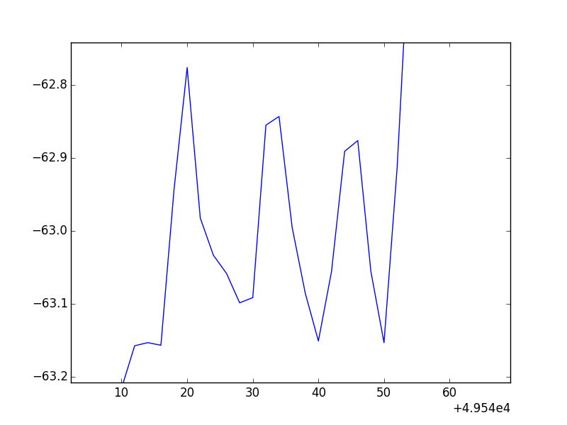

#Folders and Files

##ADCP:

- ADCP\_txt\_files\_S254 > folder containing all of the text file versions of the ADCP data collected on the last cruise.
- ADCP\_txt\_files\_S261 > folder containing all of the text file versions of the ADCP data collected on this cruise. Not always up to date unless we pull the information down ourselves.
- adcpS261.npz > numpy compressed file containing all of the lat, long, east vectors, and north vectors for easy graphing. Goes through first 20 bins.
- adcpS261\_all\_depths.npz > numpy compressed file containing all of the lat, long, east vectors, and north vectors for easy graphing. Goes through all valid bins...

##BATWING:

- Files of the form S261-stationNumber-latlon.csv > contain the lat, long, depth, temp, sal, and fluorescence (as well as time stamp though it is not needed for graphing). These lat and long pairs seem to jump around and the fluorescence data seems to be inconsistent... Does there need to be normalization?
- winslow\_tows.csv > contains lat, long, depth, temp, sal, and fluorescence for all tows in one big file. The lat, long, and depths seem to be alright for this file but there are occasional negatives in fluorescence data...
- batwing\_converter.py > takes the winslow\_tows.csv file and creates a numpy compressed file (ignoring date and time
- batwing.npz > numpy compressed file of lat, long, depth, temp, salinity, and fluorescence
- IMG folder with some examples of problems that I encountered while binning

##CHL-A:

- chlorophyll-a\_data\_template.xlsx > template file detailing the three files that I would like from the carousel data:
	- extracted values
	- continuous volts from fluorometer
	- binned data based on average of continuous, and function for extracted values

##ETOPO:

- etopo\_converter.py > takes the PIPA\_GIS/ETOPO data.cv file; gets the lat, long, and depth values for windslow reef; properly formats them; and puts them into a numpy compressed file. Only needs to be run once.
- etopo\_windslow.npz > etopo data for windslow reef in numpy format. Makes graphing easy.
- etopo\_pipa.npz > numpy compressed file, but for all of pipa as the stations do not fit in the original bounding box of the seamount (limited to topography, not looking at possible extent of impact)
- PIPA\_GIS > folder containing all of the data you need to open up PIPA in a GIS program (namely qGIS).

##TEMP\_SAL:

- ctd\_HC\_raw+binned.xlsx > Excel file containing 13 sheets, 1 for each of the 12 stations on our approach to Windslow and 1 sheet with all of the data from the stations merged. Each sheet has the raw and binned versions of our data.
- ctd\_HC\_binned.csv and ctd\_HC\_raw.csv > exported Excel files that have all of the binned and raw data (respectively) in csv format
- ctd\_HC\_converter.py > takes the csv files and creates compressed numpy files for easy coding
- ctd\_HC\_binned.npz and ctd\_HC\_raw.npz > data in a numpy format
- xyzTSSigma.txt > test file containing all of the lat, long, depths, temp, sal, and sigma (density) for a random region of our cruise.

##ZOOPL:

- zooplankton\_data\_template.xlsx > contains the start lat/long and end lat/long, depth, density and diversity for each tow.
- ALMOST COMPLETE zooplankton\_data\_edited by Sage Aug 8.xlsx > A version of the template file that includes the data from the various tows we did over Winslow. Uses the start lat/long not a midpoint, but uses a midpoint for depth... Still needs dry weight and other parameters.
- zooplankton\_data.csv > file containing tow data for easier processing
- zoopl\_converter.py > takes csv file and creates numpy compressed file of lat, long, depth, density, and diversity
- zooplankton.npz > numpy compressed file for easy graphing

---

#TO-DO:

- Is the data from BATWING tows normalized?
	- Do we want to bin BATWING data? If so there are some issues with this such as how to deal with multiple "yo's" (up and downs) and noise in the data  that crosses the normal bounds for binning... Another issue is that towards the bottom, a larger swath of datapoints may exist in a single bin and thus may skew the average due to distance (however, when looking over the time plots I didn't see many instances of this). Further, towards the bottom, sometimes our datapoints dip into the lower bins by only a meter or two, making the average non-uniform over the whole bin. 
- General question about binning > what do we do with the data from 0 - 13 meters for the CTD/Fluorometer data?
- Populate three excel files in CHL-A with data that follow the forms detailed in the template file.
	- Also, convert these to csv files (save as > csv), then write a program in CHL-A that take the data and converts it to a numpy compressed file.
- Populate excel file in ZOOPL with any additional data (such as tows leading up to Winslow?) and conversions (such as dry weight/biomass/and biomass carbon)...
	- Discuss if this covers what we need, such as, do we want to show the midpoint or a line/contour OR is there more information to add such as dry weight
- Discuss how to approach visualization... angles? cutoffs (depth)? single layers?
	- Statistical analysis of data (as visualization may prove to be less than satisfactory).
- Discuss if we want nutrients (NO3 and PO4) and pH. If we do we need to get that data and process it.

##We have:

- 2 major biological factors:
	- Chl-a
		- Fluorometer in Volt (continuous)
		- Extract values (at 7 depths)
		- Binned extracted values based off of continuous
	- Zooplankton (2 kinds of tows at 3-4 depths)
		- Density
		- Diversity
		- (possibly) Dry weight
- 5 major physical factors:
	- Topography (more for visualization sake)
	- Currents (ADCP)
	- Temperature (binned and non binned)
	- Salinity (binned and non binned)
	- Density (based off of temp and sal)
- 3 other physical factors:
	- pH
	- NO3
	- PO4